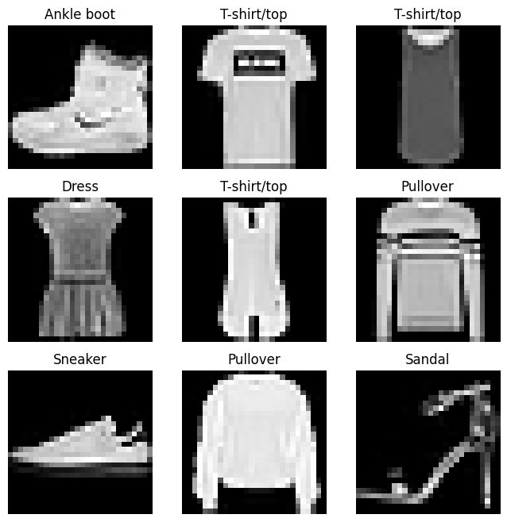
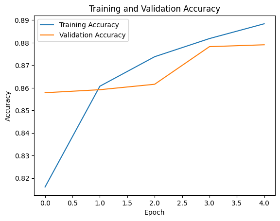
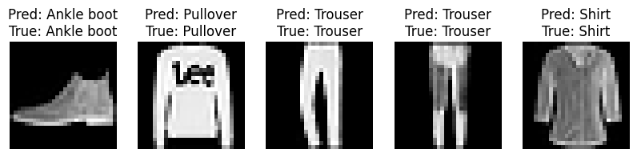

# Deep Learning FashionMNIST Classifier

## Project Description

This project is a simple Deep Learning image classification model built using TensorFlow and Keras. The model is trained on the Fashion-MNIST dataset to classify clothing items into different categories.

## Dataset

Fashion-MNIST contains grayscale images of clothing items.

* 60,000 training images
* 10,000 testing images
* 10 classes
* Image size: 28 × 28 pixels

## Tools Used

* Python
* TensorFlow
* Keras
* NumPy
* Matplotlib
* Google Colab

## Model Architecture

* Flatten Layer
* Dense Layer (128 neurons, ReLU)
* Dense Layer (64 neurons, ReLU)
* Output Layer (10 neurons, Softmax)

Total Parameters: 109,386

## Results

| Metric              | Value  |
| ------------------- | ------ |
| Training Accuracy   | 88.98% |
| Validation Accuracy | 86.98% |
| Test Accuracy       | 86.47% |
| Test Loss           | 0.3738 |

## Sample Images

## Accuracy Graph

## Prediction Results

## Conclusion

The model achieved a test accuracy of 86.47%. The results show that a simple neural network can classify Fashion-MNIST images with good accuracy.

## Future Improvements

* Use a CNN model
* Train for more epochs
* Apply data augmentation
* Test on real-world images
